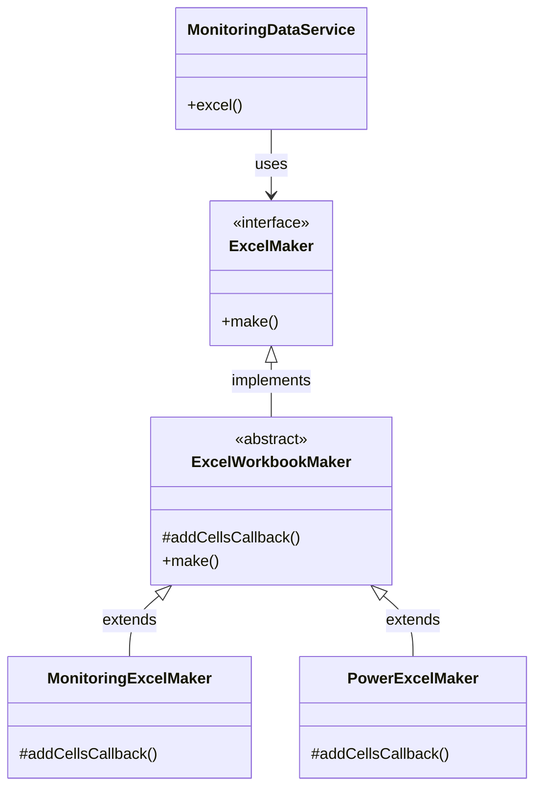

# 엑셀 다운로드 기능

## 요구사항은
1. '엑셀 파일을 다운로드 하는 API'입니다. 
2. Monitoring이라는 Domain과 Power라는 Domain이 있고  
3. 각 도메인은 요구되는 엑셀파일의 모양이 다릅니다.
   - Monitoring의 경우 컬럼이 quantity, spm이 들어갑니다.
   - Power의 경우 컬럼이 voltageL1L2, voltageL2L3, voltageL3L1 이 들어갑니다.
4. 달라지는 부분은 Column과 Row의 생김새가 달라집니다.

5. 다국어를 지원 합니다. 언어는 Controller를 통해 입력 받습니다. ex)ko, en, jp 등

# ERD

## 사용한 라이브러리
- SpringBoot
- POI

## 실행 방법
- gradle 빌드 후 ExcelExporter2Application 으로 실행

## 호출
GET http://localhost:8080/api/v1/monitoring/excel  
GET http://localhost:8080/api/v1/power/excel  

